# Dry Streak Tracker

Dry Streak Tracker is a RuneLite plugin that automatically tracks how dry you are between unique drops at supported bosses, raids, skilling encounters, and other loot-based content.

Open the **Dry Streak Tracker** side panel to see your progress while you play.

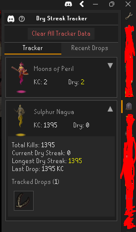

## How It Works

Every kill or completion without a tracked unique increases your **Dry KC**.

When you receive a tracked unique, the plugin records how many kills it took, saves the completed streak, and resets your current dry streak.

For each encounter, the tracker shows:

- **KC** - Total kills or completions tracked.
- **Dry** - Your current dry streak.
- **Longest Dry Streak** - Your longest recorded dry streak.
- **Tracked Drops** - Unique drops you've received and how many times for each.

If your current dry streak passes your previous longest, you've set a new dry streak record.

## Starting With Existing KC

You don't need to start at 0 KC.

Right-click an encounter and select **Set KC / Dry Streak...** to enter or correct your:

- Total KC
- Current Dry KC
- Longest Dry KC

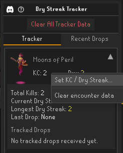 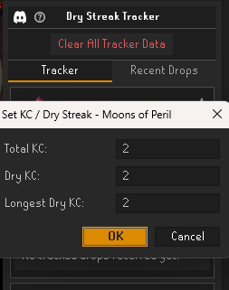

This lets you synchronize the plugin with your existing progress before you start tracking.

## Unique Drops & Pets

When you receive a tracked unique, Dry Streak Tracker automatically:

- Records the drop and completed dry streak.
- Resets your current dry streak.
- Adds the item to your tracked drops.
- Adds it to your **Recent Drops** history.
- Sends enabled RuneLite or Discord notifications.

Supported pets can also be tracked as uniques when **Pet Tracking** is enabled in our plugin settings.

## Recent Drops

The **Recent Drops** tab keeps a history of your recently tracked uniques and shows how many kills each unique took to receive.

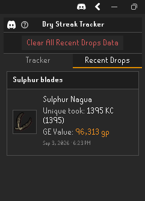

Recent Drops can be cleared separately without resetting your encounter statistics.

## Configuring Tracked Drops

You can choose which supported unique drops count toward your dry streak for each encounter.

Right-click an encounter and select **Configure Tracked Drops...** to view all configurable drops for that encounter.

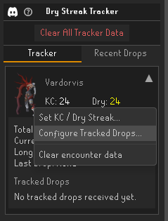 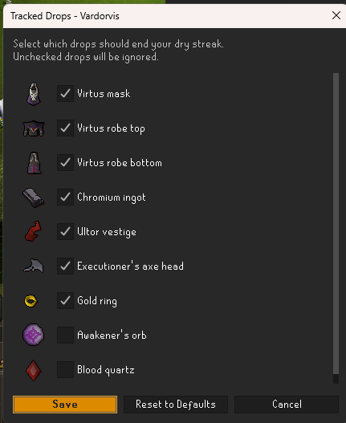

Use the checkboxes to choose which drops you want to track:

- **Checked drops** count as uniques and will end your current dry streak when received.
- **Unchecked drops** are ignored and will not reset your dry streak.

This is useful for encounters where you may only care about certain uniques, or where some less significant drops are available to track but are disabled by default.

Your choices are saved separately for each encounter and will be remembered between sessions.

Select **Reset to Defaults** at any time to restore the plugin's default tracked drops for that encounter.

Changing your tracked drop settings only affects future drops. It does not remove or change drops you have already received or your existing tracking history.

## Custom NPC Tracking

Want to track an NPC that isn't already supported? You can create your own tracker directly in-game.

Enable **Custom NPC Tracking** in the plugin settings, then right-click the NPC you want to track and select **Add to Dry Streak Tracker**.

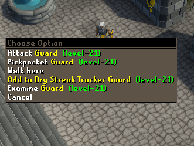

The plugin will load the NPC's drop table and let you choose which drops should count as uniques.

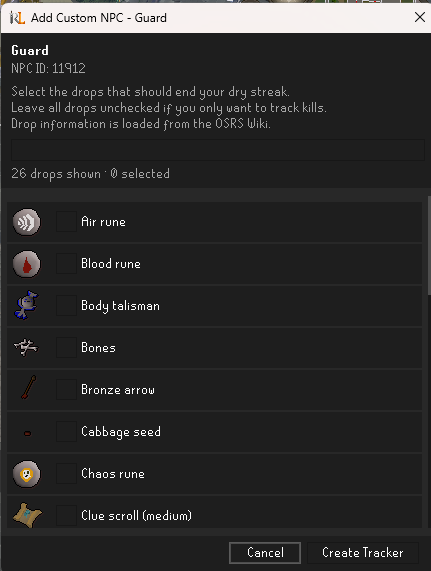

Select the drops you want to track and choose **Create Tracker**. Your custom NPC will then appear in the Dry Streak Tracker side panel and begin tracking automatically when you kill it.

You can also leave all drops unchecked if you only want to track kills and your current dry streak without having a drop reset it.

### Editing a Custom NPC Tracker

Right-click the NPC again and select **Configure Dry Streak Tracker** to change its tracked drops or edit/delete the custom tracker through the encounter panel.

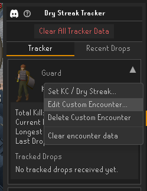

Custom NPC trackers and their progress are saved separately for each RuneScape account.

## Smoke Lootbeams

Smoke Lootbeams add an animated smoke effect above tracked unique drops you receive on the ground, making those special drops a little harder to miss.

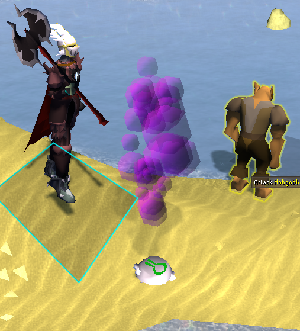

Smoke Lootbeams can be enabled or disabled under **Cosmetic Effects** in the plugin settings.

You can also choose your preferred smoke color.

The effect is cosmetic only and does not change how drops or dry streaks are tracked.

## Notifications & Discord

Dry Streak Tracker can notify you when you:

- Receive a tracked unique.
- Receive a supported pet.
- Set a new longest dry streak.

If you configure a **Discord webhook** in the plugin settings, you can also send drop and milestone notifications to Discord.

### Automatic Discord Submissions

When automatic Discord submissions are enabled, tracked drops can be sent to your configured Discord webhook automatically.

Depending on your settings, these submissions can include:

- The encounter and item received.
- Your dry streak / KC information.
- The item's GE value.
- A RuneLite screenshot taken when the drop is received.

### Manually Uploading a Recent Drop

You can also upload a drop later from the **Recent Drops** tab.

Right-click a recent drop and select **Upload to Discord**.

This option is available when a Discord webhook has been configured.

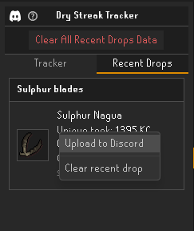 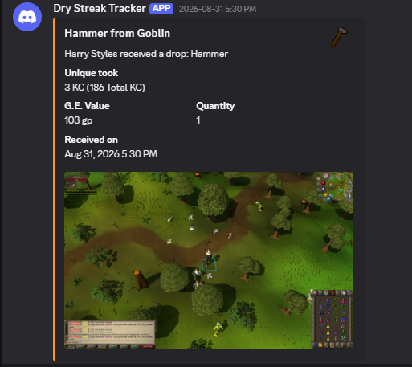

## Resetting or Correcting Tracking

Right-click an encounter to:

- **Set KC / Dry Streak...** - Manually correct your tracking information.
- **Clear encounter data** - Completely reset that encounter.

The **Clear** button at the top of the side panel can also clear the currently selected Tracker or Recent Drops section.

## Account-Specific Tracking

Tracking data is saved separately for each RuneScape account and automatically loaded when you log in.

You don't need to manually select what you're fighting — supported encounters are detected automatically while you play.

## Supported Encounters

Dry Streak Tracker supports a growing list of bosses, raids, skilling encounters, and other loot-based activities.

More encounters and drops will continue to be added.

If you find a missing encounter or unique, please let us know! (Even non-bosses that have uniques!)

## Discord & Support

Join the **Dry Streak Tracker Discord** to:

- Report missing encounters or drops
- Report bugs
- Suggest new features
- Get help with the plugin

Discord: https://discord.gg/xyWgaHDmnh

You can also find the Discord link directly in the Dry Streak Tracker side panel.

Feedback and suggestions are always welcome!